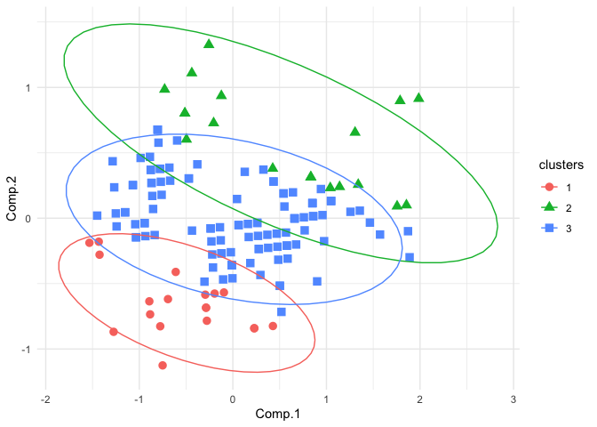

<!-- README.md is generated from README.Rmd. Please edit that file -->

# clust431

<!-- badges: start -->
<!-- badges: end -->

The goal of clust431, created by Nils, Ryuhei, and Scott, is to provide
R users with a K-means algorithm to assign k-clusters to any set of
numerical data. The `k-means()` function has the ability to use a
K-means++ algorithm to assign the original k-centroids, or use random
assignment if `pca == FALSE`.

clust431 also provides R users with the `hier_clust()` function, which
outputs cluster assignment based on Hierarchical Agglomerative
Clustering. By default, the distance measurement used to calculate
clustering assignments is `method = "euclidean"`, but the methods
`"euclidean", "maximum", "manhattan", "canberra", "binary", "minkowski"`
can be input.

## Installation

You can install the released version of clust431 from
[CRAN](https://CRAN.R-project.org) with:

``` r
install.packages("clust431")
```

## Loading package

``` r
library(clust431)
```

## Information from k_means function

- Users are provided with the observations’ cluster assignments,
  distance to their respective cluster centroid, centroid coordinates of
  each respective cluster centroid, number of iterations to achieve the
  same clustering assignment, and the total sum of squares of the
  observations to the mean centroid of that data set.

``` r
k_means(iris, 3, pca = FALSE)
#> $Clusterings
#>     Sepal.Length Sepal.Width Petal.Length Petal.Width clusters
#> 1            5.1         3.5          1.4         0.2        1
#> 2            4.9         3.0          1.4         0.2        1
#> 3            4.7         3.2          1.3         0.2        1
#> 4            4.6         3.1          1.5         0.2        1
#> 5            5.0         3.6          1.4         0.2        1
#> 6            5.4         3.9          1.7         0.4        2
#> 7            4.6         3.4          1.4         0.3        1
#> 8            5.0         3.4          1.5         0.2        1
#> 9            4.4         2.9          1.4         0.2        1
#> 10           4.9         3.1          1.5         0.1        1
#> 11           5.4         3.7          1.5         0.2        2
#> 12           4.8         3.4          1.6         0.2        1
#> 13           4.8         3.0          1.4         0.1        1
#> 14           4.3         3.0          1.1         0.1        1
#> 15           5.8         4.0          1.2         0.2        2
#> 16           5.7         4.4          1.5         0.4        2
#> 17           5.4         3.9          1.3         0.4        2
#> 18           5.1         3.5          1.4         0.3        1
#> 19           5.7         3.8          1.7         0.3        2
#> 20           5.1         3.8          1.5         0.3        2
#> 21           5.4         3.4          1.7         0.2        1
#> 22           5.1         3.7          1.5         0.4        2
#> 23           4.6         3.6          1.0         0.2        1
#> 24           5.1         3.3          1.7         0.5        2
#> 25           4.8         3.4          1.9         0.2        1
#> 26           5.0         3.0          1.6         0.2        1
#> 27           5.0         3.4          1.6         0.4        1
#> 28           5.2         3.5          1.5         0.2        1
#> 29           5.2         3.4          1.4         0.2        1
#> 30           4.7         3.2          1.6         0.2        1
#> 31           4.8         3.1          1.6         0.2        1
#> 32           5.4         3.4          1.5         0.4        1
#> 33           5.2         4.1          1.5         0.1        2
#> 34           5.5         4.2          1.4         0.2        2
#> 35           4.9         3.1          1.5         0.2        1
#> 36           5.0         3.2          1.2         0.2        1
#> 37           5.5         3.5          1.3         0.2        1
#> 38           4.9         3.6          1.4         0.1        1
#> 39           4.4         3.0          1.3         0.2        1
#> 40           5.1         3.4          1.5         0.2        1
#> 41           5.0         3.5          1.3         0.3        1
#> 42           4.5         2.3          1.3         0.3        1
#> 43           4.4         3.2          1.3         0.2        1
#> 44           5.0         3.5          1.6         0.6        2
#> 45           5.1         3.8          1.9         0.4        2
#> 46           4.8         3.0          1.4         0.3        1
#> 47           5.1         3.8          1.6         0.2        2
#> 48           4.6         3.2          1.4         0.2        1
#> 49           5.3         3.7          1.5         0.2        2
#> 50           5.0         3.3          1.4         0.2        1
#> 51           7.0         3.2          4.7         1.4        3
#> 52           6.4         3.2          4.5         1.5        3
#> 53           6.9         3.1          4.9         1.5        3
#> 54           5.5         2.3          4.0         1.3        2
#> 55           6.5         2.8          4.6         1.5        3
#> 56           5.7         2.8          4.5         1.3        3
#> 57           6.3         3.3          4.7         1.6        3
#> 58           4.9         2.4          3.3         1.0        2
#> 59           6.6         2.9          4.6         1.3        3
#> 60           5.2         2.7          3.9         1.4        2
#> 61           5.0         2.0          3.5         1.0        2
#> 62           5.9         3.0          4.2         1.5        2
#> 63           6.0         2.2          4.0         1.0        2
#> 64           6.1         2.9          4.7         1.4        3
#> 65           5.6         2.9          3.6         1.3        2
#> 66           6.7         3.1          4.4         1.4        3
#> 67           5.6         3.0          4.5         1.5        3
#> 68           5.8         2.7          4.1         1.0        2
#> 69           6.2         2.2          4.5         1.5        3
#> 70           5.6         2.5          3.9         1.1        2
#> 71           5.9         3.2          4.8         1.8        3
#> 72           6.1         2.8          4.0         1.3        2
#> 73           6.3         2.5          4.9         1.5        3
#> 74           6.1         2.8          4.7         1.2        3
#> 75           6.4         2.9          4.3         1.3        3
#> 76           6.6         3.0          4.4         1.4        3
#> 77           6.8         2.8          4.8         1.4        3
#> 78           6.7         3.0          5.0         1.7        3
#> 79           6.0         2.9          4.5         1.5        3
#> 80           5.7         2.6          3.5         1.0        2
#> 81           5.5         2.4          3.8         1.1        2
#> 82           5.5         2.4          3.7         1.0        2
#> 83           5.8         2.7          3.9         1.2        2
#> 84           6.0         2.7          5.1         1.6        3
#> 85           5.4         3.0          4.5         1.5        3
#> 86           6.0         3.4          4.5         1.6        3
#> 87           6.7         3.1          4.7         1.5        3
#> 88           6.3         2.3          4.4         1.3        3
#> 89           5.6         3.0          4.1         1.3        2
#> 90           5.5         2.5          4.0         1.3        2
#> 91           5.5         2.6          4.4         1.2        2
#> 92           6.1         3.0          4.6         1.4        3
#> 93           5.8         2.6          4.0         1.2        2
#> 94           5.0         2.3          3.3         1.0        2
#> 95           5.6         2.7          4.2         1.3        2
#> 96           5.7         3.0          4.2         1.2        2
#> 97           5.7         2.9          4.2         1.3        2
#> 98           6.2         2.9          4.3         1.3        3
#> 99           5.1         2.5          3.0         1.1        2
#> 100          5.7         2.8          4.1         1.3        2
#> 101          6.3         3.3          6.0         2.5        3
#> 102          5.8         2.7          5.1         1.9        3
#> 103          7.1         3.0          5.9         2.1        3
#> 104          6.3         2.9          5.6         1.8        3
#> 105          6.5         3.0          5.8         2.2        3
#> 106          7.6         3.0          6.6         2.1        3
#> 107          4.9         2.5          4.5         1.7        2
#> 108          7.3         2.9          6.3         1.8        3
#> 109          6.7         2.5          5.8         1.8        3
#> 110          7.2         3.6          6.1         2.5        3
#> 111          6.5         3.2          5.1         2.0        3
#> 112          6.4         2.7          5.3         1.9        3
#> 113          6.8         3.0          5.5         2.1        3
#> 114          5.7         2.5          5.0         2.0        3
#> 115          5.8         2.8          5.1         2.4        3
#> 116          6.4         3.2          5.3         2.3        3
#> 117          6.5         3.0          5.5         1.8        3
#> 118          7.7         3.8          6.7         2.2        3
#> 119          7.7         2.6          6.9         2.3        3
#> 120          6.0         2.2          5.0         1.5        3
#> 121          6.9         3.2          5.7         2.3        3
#> 122          5.6         2.8          4.9         2.0        3
#> 123          7.7         2.8          6.7         2.0        3
#> 124          6.3         2.7          4.9         1.8        3
#> 125          6.7         3.3          5.7         2.1        3
#> 126          7.2         3.2          6.0         1.8        3
#> 127          6.2         2.8          4.8         1.8        3
#> 128          6.1         3.0          4.9         1.8        3
#> 129          6.4         2.8          5.6         2.1        3
#> 130          7.2         3.0          5.8         1.6        3
#> 131          7.4         2.8          6.1         1.9        3
#> 132          7.9         3.8          6.4         2.0        3
#> 133          6.4         2.8          5.6         2.2        3
#> 134          6.3         2.8          5.1         1.5        3
#> 135          6.1         2.6          5.6         1.4        3
#> 136          7.7         3.0          6.1         2.3        3
#> 137          6.3         3.4          5.6         2.4        3
#> 138          6.4         3.1          5.5         1.8        3
#> 139          6.0         3.0          4.8         1.8        3
#> 140          6.9         3.1          5.4         2.1        3
#> 141          6.7         3.1          5.6         2.4        3
#> 142          6.9         3.1          5.1         2.3        3
#> 143          5.8         2.7          5.1         1.9        3
#> 144          6.8         3.2          5.9         2.3        3
#> 145          6.7         3.3          5.7         2.5        3
#> 146          6.7         3.0          5.2         2.3        3
#> 147          6.3         2.5          5.0         1.9        3
#> 148          6.5         3.0          5.2         2.0        3
#> 149          6.2         3.4          5.4         2.3        3
#> 150          5.9         3.0          5.1         1.8        3
#>     smallest_distances
#> 1            0.0000000
#> 2            0.5385165
#> 3            0.5099020
#> 4            0.6480741
#> 5            0.1414214
#> 6            0.4123106
#> 7            0.5196152
#> 8            0.1732051
#> 9            0.9219544
#> 10           0.4690416
#> 11           0.3605551
#> 12           0.3741657
#> 13           0.5916080
#> 14           0.9949874
#> 15           0.8426150
#> 16           0.9219544
#> 17           0.4123106
#> 18           0.1000000
#> 19           0.6480741
#> 20           0.1414214
#> 21           0.4358899
#> 22           0.0000000
#> 23           0.6480741
#> 24           0.4582576
#> 25           0.5916080
#> 26           0.5477226
#> 27           0.3162278
#> 28           0.1414214
#> 29           0.1414214
#> 30           0.5385165
#> 31           0.5385165
#> 32           0.3872983
#> 33           0.5099020
#> 34           0.6782330
#> 35           0.4582576
#> 36           0.3741657
#> 37           0.4123106
#> 38           0.2449490
#> 39           0.8660254
#> 40           0.1414214
#> 41           0.1732051
#> 42           1.3490738
#> 43           0.7681146
#> 44           0.3162278
#> 45           0.4123106
#> 46           0.5916080
#> 47           0.2449490
#> 48           0.5830952
#> 49           0.2828427
#> 50           0.2236068
#> 51           2.1023796
#> 52           2.5436195
#> 53           1.9974984
#> 54           3.0298515
#> 55           2.5396850
#> 56           3.1527766
#> 57           2.4207437
#> 58           2.3086793
#> 59           2.4959968
#> 60           2.7874720
#> 61           2.6944387
#> 62           3.1032241
#> 63           3.1096624
#> 64           2.7018512
#> 65           2.4718414
#> 66           2.5079872
#> 67           3.1288976
#> 68           2.9342802
#> 69           3.0512293
#> 70           2.8178006
#> 71           2.6381812
#> 72           2.9782545
#> 73           2.5980762
#> 74           2.7874720
#> 75           2.8213472
#> 76           2.5865034
#> 77           2.2649503
#> 78           2.0322401
#> 79           2.8774989
#> 80           2.4351591
#> 81           2.7622455
#> 82           2.6551836
#> 83           2.8089144
#> 84           2.5826343
#> 85           3.2787193
#> 86           2.7459060
#> 87           2.2516660
#> 88           3.0495901
#> 89           2.8827071
#> 90           2.9427878
#> 91           3.2280025
#> 92           2.7349589
#> 93           2.9308702
#> 94           2.3600847
#> 95           3.0577770
#> 96           2.9631065
#> 97           3.0166206
#> 98           2.9325757
#> 99           2.0445048
#> 100          2.9563491
#> 101          1.7944358
#> 102          2.7055499
#> 103          1.2409674
#> 104          2.0124612
#> 105          1.7320508
#> 106          0.8831761
#> 107          3.4885527
#> 108          1.1045361
#> 109          1.8788294
#> 110          0.9327379
#> 111          2.0024984
#> 112          2.1633308
#> 113          1.6340135
#> 114          2.9137605
#> 115          2.6944387
#> 116          1.9773720
#> 117          1.8574176
#> 118          0.4123106
#> 119          1.3490738
#> 120          2.8948230
#> 121          1.3928388
#> 122          2.9223278
#> 123          1.0630146
#> 124          2.4617067
#> 125          1.4798649
#> 126          1.0246951
#> 127          2.5475478
#> 128          2.4839485
#> 129          1.9748418
#> 130          1.2845233
#> 131          1.1618950
#> 132          0.0000000
#> 133          1.9824228
#> 134          2.3452079
#> 135          2.3832751
#> 136          0.9273618
#> 137          1.8761663
#> 138          1.8947295
#> 139          2.6172505
#> 140          1.5811388
#> 141          1.6522712
#> 142          1.8083141
#> 143          2.7055499
#> 144          1.3820275
#> 145          1.5588457
#> 146          1.9000000
#> 147          2.4939928
#> 148          2.0099751
#> 149          2.0346990
#> 150          2.5238859
#> 
#> $`Cluster Means`
#>     Sepal.Length Sepal.Width Petal.Length Petal.Width
#> 1            5.1         3.5          1.4         0.2
#> 22           5.1         3.7          1.5         0.4
#> 132          7.9         3.8          6.4         2.0
#> 
#> $Iterations
#> [1] 1
#> 
#> $`Total Sum of Squares`
#> [1] 291.6103
```

## Plot genereated from k_means function

``` r
results <- k_means(iris, 3, pca = TRUE)
plot_clusterings(results$Clusterings)
```



In that case, don’t forget to commit and push the resulting figure
files, so they display on GitHub!

## Hierarchical Agglomerative Clustering

``` r
hier_clust(iris)
#> Warning in dist(data, method = method, diag = TRUE, upper = TRUE): NAs
#> introduced by coercion
#>   [1]  42  60 133 137  26  51  74 125  76 109 138 140 102 143  12  37  25  27
#>  [19]  17  62 105  13  47 139  92 120 110 111  73 124  84  94  44  68  20  93
#>  [37]  87 113  56  71 142 148 149  34  66 112 135  96  65 101 100 141  32  97
#>  [55]  48  50 147   6  43   1  19  98 118   7  24   2  53 122 145  30  72  35
#>  [73]  49  88 115 130   8  40 106 134  80  83 126 146  39  41   5  57  70 103
#>  [91] 127 150   4  16 136  95 107  22  45  89  90 104 129  15  29  81  85  21
#> [109]  31  36  38 114 119  67 144  78  33  63  61  69  18  64  46  54  75  99
#> [127]  77 108 131 116  10  11 123 117 121   3  58   9  28  82  86  14  52  23
#> [145]  55 128 132  59  79  91
```
