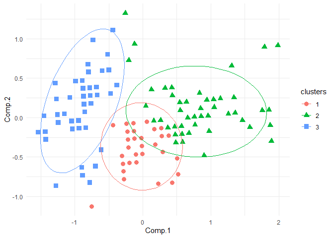

<!-- README.md is generated from README.Rmd. Please edit that file -->

# clust431

<!-- badges: start -->
<!-- badges: end -->

The goal of clust431, created by Nils, Ryuhei, and Scott, is to provide
R users with a K-means algorithm to assign k-clusters to any set of
numerical data. The `k-means()` function has the ability to use a
K-means++ algorithm to assign the original k-centroids, or use random
assignment if `pca == FALSE`.

clust431 also provides R users with the `hier_clust()` function, which
outputs cluster assignment based on Hierarchical Agglomerative
Clustering. By default, the distance measurement used to calculate
clustering assignments is `method = "euclidean"`, but the methods
`"euclidean", "maximum", "manhattan", "canberra", "binary", "minkowski"`
can be input.

## Installation

You can install the released version of clust431 from
[CRAN](https://CRAN.R-project.org) with:

``` r
install.packages("clust431")
```

## Loading package

``` r
library(clust431)
```

## Information from k_means function

- Users are provided with the observations’ cluster assignments,
  distance to their respective cluster centroid, centroid coordinates of
  each respective cluster centroid, number of iterations to achieve the
  same clustering assignment, and the total sum of squares of the
  observations to the mean centroid of that data set.

``` r
k_means(iris, 3, pca = FALSE)
#> $Clusterings
#>     Sepal.Length Sepal.Width Petal.Length Petal.Width clusters
#> 1            5.1         3.5          1.4         0.2        2
#> 2            4.9         3.0          1.4         0.2        2
#> 3            4.7         3.2          1.3         0.2        2
#> 4            4.6         3.1          1.5         0.2        2
#> 5            5.0         3.6          1.4         0.2        2
#> 6            5.4         3.9          1.7         0.4        3
#> 7            4.6         3.4          1.4         0.3        2
#> 8            5.0         3.4          1.5         0.2        2
#> 9            4.4         2.9          1.4         0.2        2
#> 10           4.9         3.1          1.5         0.1        2
#> 11           5.4         3.7          1.5         0.2        1
#> 12           4.8         3.4          1.6         0.2        2
#> 13           4.8         3.0          1.4         0.1        2
#> 14           4.3         3.0          1.1         0.1        2
#> 15           5.8         4.0          1.2         0.2        3
#> 16           5.7         4.4          1.5         0.4        3
#> 17           5.4         3.9          1.3         0.4        3
#> 18           5.1         3.5          1.4         0.3        2
#> 19           5.7         3.8          1.7         0.3        1
#> 20           5.1         3.8          1.5         0.3        2
#> 21           5.4         3.4          1.7         0.2        1
#> 22           5.1         3.7          1.5         0.4        2
#> 23           4.6         3.6          1.0         0.2        2
#> 24           5.1         3.3          1.7         0.5        2
#> 25           4.8         3.4          1.9         0.2        2
#> 26           5.0         3.0          1.6         0.2        2
#> 27           5.0         3.4          1.6         0.4        2
#> 28           5.2         3.5          1.5         0.2        2
#> 29           5.2         3.4          1.4         0.2        2
#> 30           4.7         3.2          1.6         0.2        2
#> 31           4.8         3.1          1.6         0.2        2
#> 32           5.4         3.4          1.5         0.4        1
#> 33           5.2         4.1          1.5         0.1        3
#> 34           5.5         4.2          1.4         0.2        3
#> 35           4.9         3.1          1.5         0.2        2
#> 36           5.0         3.2          1.2         0.2        2
#> 37           5.5         3.5          1.3         0.2        1
#> 38           4.9         3.6          1.4         0.1        2
#> 39           4.4         3.0          1.3         0.2        2
#> 40           5.1         3.4          1.5         0.2        2
#> 41           5.0         3.5          1.3         0.3        2
#> 42           4.5         2.3          1.3         0.3        2
#> 43           4.4         3.2          1.3         0.2        2
#> 44           5.0         3.5          1.6         0.6        2
#> 45           5.1         3.8          1.9         0.4        1
#> 46           4.8         3.0          1.4         0.3        2
#> 47           5.1         3.8          1.6         0.2        2
#> 48           4.6         3.2          1.4         0.2        2
#> 49           5.3         3.7          1.5         0.2        1
#> 50           5.0         3.3          1.4         0.2        2
#> 51           7.0         3.2          4.7         1.4        1
#> 52           6.4         3.2          4.5         1.5        1
#> 53           6.9         3.1          4.9         1.5        1
#> 54           5.5         2.3          4.0         1.3        1
#> 55           6.5         2.8          4.6         1.5        1
#> 56           5.7         2.8          4.5         1.3        1
#> 57           6.3         3.3          4.7         1.6        1
#> 58           4.9         2.4          3.3         1.0        1
#> 59           6.6         2.9          4.6         1.3        1
#> 60           5.2         2.7          3.9         1.4        1
#> 61           5.0         2.0          3.5         1.0        1
#> 62           5.9         3.0          4.2         1.5        1
#> 63           6.0         2.2          4.0         1.0        1
#> 64           6.1         2.9          4.7         1.4        1
#> 65           5.6         2.9          3.6         1.3        1
#> 66           6.7         3.1          4.4         1.4        1
#> 67           5.6         3.0          4.5         1.5        1
#> 68           5.8         2.7          4.1         1.0        1
#> 69           6.2         2.2          4.5         1.5        1
#> 70           5.6         2.5          3.9         1.1        1
#> 71           5.9         3.2          4.8         1.8        1
#> 72           6.1         2.8          4.0         1.3        1
#> 73           6.3         2.5          4.9         1.5        1
#> 74           6.1         2.8          4.7         1.2        1
#> 75           6.4         2.9          4.3         1.3        1
#> 76           6.6         3.0          4.4         1.4        1
#> 77           6.8         2.8          4.8         1.4        1
#> 78           6.7         3.0          5.0         1.7        1
#> 79           6.0         2.9          4.5         1.5        1
#> 80           5.7         2.6          3.5         1.0        1
#> 81           5.5         2.4          3.8         1.1        1
#> 82           5.5         2.4          3.7         1.0        1
#> 83           5.8         2.7          3.9         1.2        1
#> 84           6.0         2.7          5.1         1.6        1
#> 85           5.4         3.0          4.5         1.5        1
#> 86           6.0         3.4          4.5         1.6        1
#> 87           6.7         3.1          4.7         1.5        1
#> 88           6.3         2.3          4.4         1.3        1
#> 89           5.6         3.0          4.1         1.3        1
#> 90           5.5         2.5          4.0         1.3        1
#> 91           5.5         2.6          4.4         1.2        1
#> 92           6.1         3.0          4.6         1.4        1
#> 93           5.8         2.6          4.0         1.2        1
#> 94           5.0         2.3          3.3         1.0        1
#> 95           5.6         2.7          4.2         1.3        1
#> 96           5.7         3.0          4.2         1.2        1
#> 97           5.7         2.9          4.2         1.3        1
#> 98           6.2         2.9          4.3         1.3        1
#> 99           5.1         2.5          3.0         1.1        1
#> 100          5.7         2.8          4.1         1.3        1
#> 101          6.3         3.3          6.0         2.5        1
#> 102          5.8         2.7          5.1         1.9        1
#> 103          7.1         3.0          5.9         2.1        1
#> 104          6.3         2.9          5.6         1.8        1
#> 105          6.5         3.0          5.8         2.2        1
#> 106          7.6         3.0          6.6         2.1        1
#> 107          4.9         2.5          4.5         1.7        1
#> 108          7.3         2.9          6.3         1.8        1
#> 109          6.7         2.5          5.8         1.8        1
#> 110          7.2         3.6          6.1         2.5        1
#> 111          6.5         3.2          5.1         2.0        1
#> 112          6.4         2.7          5.3         1.9        1
#> 113          6.8         3.0          5.5         2.1        1
#> 114          5.7         2.5          5.0         2.0        1
#> 115          5.8         2.8          5.1         2.4        1
#> 116          6.4         3.2          5.3         2.3        1
#> 117          6.5         3.0          5.5         1.8        1
#> 118          7.7         3.8          6.7         2.2        1
#> 119          7.7         2.6          6.9         2.3        1
#> 120          6.0         2.2          5.0         1.5        1
#> 121          6.9         3.2          5.7         2.3        1
#> 122          5.6         2.8          4.9         2.0        1
#> 123          7.7         2.8          6.7         2.0        1
#> 124          6.3         2.7          4.9         1.8        1
#> 125          6.7         3.3          5.7         2.1        1
#> 126          7.2         3.2          6.0         1.8        1
#> 127          6.2         2.8          4.8         1.8        1
#> 128          6.1         3.0          4.9         1.8        1
#> 129          6.4         2.8          5.6         2.1        1
#> 130          7.2         3.0          5.8         1.6        1
#> 131          7.4         2.8          6.1         1.9        1
#> 132          7.9         3.8          6.4         2.0        1
#> 133          6.4         2.8          5.6         2.2        1
#> 134          6.3         2.8          5.1         1.5        1
#> 135          6.1         2.6          5.6         1.4        1
#> 136          7.7         3.0          6.1         2.3        1
#> 137          6.3         3.4          5.6         2.4        1
#> 138          6.4         3.1          5.5         1.8        1
#> 139          6.0         3.0          4.8         1.8        1
#> 140          6.9         3.1          5.4         2.1        1
#> 141          6.7         3.1          5.6         2.4        1
#> 142          6.9         3.1          5.1         2.3        1
#> 143          5.8         2.7          5.1         1.9        1
#> 144          6.8         3.2          5.9         2.3        1
#> 145          6.7         3.3          5.7         2.5        1
#> 146          6.7         3.0          5.2         2.3        1
#> 147          6.3         2.5          5.0         1.9        1
#> 148          6.5         3.0          5.2         2.0        1
#> 149          6.2         3.4          5.4         2.3        1
#> 150          5.9         3.0          5.1         1.8        1
#>     smallest_distances
#> 1            0.1732051
#> 2            0.4242641
#> 3            0.4123106
#> 4            0.5000000
#> 5            0.2236068
#> 6            0.4795832
#> 7            0.4242641
#> 8            0.0000000
#> 9            0.7874008
#> 10           0.3316625
#> 11           0.3605551
#> 12           0.2236068
#> 13           0.4690416
#> 14           0.9055385
#> 15           0.4123106
#> 16           0.3605551
#> 17           0.3872983
#> 18           0.2000000
#> 19           0.5099020
#> 20           0.4242641
#> 21           0.0000000
#> 22           0.3741657
#> 23           0.6708204
#> 24           0.3872983
#> 25           0.4472136
#> 26           0.4123106
#> 27           0.2236068
#> 28           0.2236068
#> 29           0.2236068
#> 30           0.3741657
#> 31           0.3741657
#> 32           0.2828427
#> 33           0.3464102
#> 34           0.0000000
#> 35           0.3162278
#> 36           0.3605551
#> 37           0.4242641
#> 38           0.2645751
#> 39           0.7483315
#> 40           0.1000000
#> 41           0.2449490
#> 42           1.2288206
#> 43           0.6633250
#> 44           0.4242641
#> 45           0.5744563
#> 46           0.4690416
#> 47           0.4242641
#> 48           0.4582576
#> 49           0.3741657
#> 50           0.1414214
#> 51           3.6110940
#> 52           3.2511536
#> 53           3.7775654
#> 54           2.7784888
#> 55           3.4161382
#> 56           3.0822070
#> 57           3.4322005
#> 58           2.1095023
#> 59           3.3630343
#> 60           2.6095977
#> 61           2.4494897
#> 62           2.8896367
#> 63           2.7802878
#> 64           3.3436507
#> 65           2.2605309
#> 66           3.2419130
#> 67           3.1192948
#> 68           2.6551836
#> 69           3.4073450
#> 70           2.5495098
#> 71           3.5298725
#> 72           2.7110883
#> 73           3.6810325
#> 74           3.2939338
#> 75           3.0364453
#> 76           3.2140317
#> 77           3.6565011
#> 78           3.8716921
#> 79           3.1843367
#> 80           2.1470911
#> 81           2.4959968
#> 82           2.3769729
#> 83           2.5475478
#> 84           3.7907783
#> 85           3.1128765
#> 86           3.1874755
#> 87           3.5312887
#> 88           3.2434549
#> 89           2.6776856
#> 90           2.7055499
#> 91           2.9899833
#> 92           3.2403703
#> 93           2.6627054
#> 94           2.1377558
#> 95           2.8266588
#> 96           2.7386128
#> 97           2.7928480
#> 98           2.9765752
#> 99           1.8439089
#> 100          2.7239677
#> 101          4.9598387
#> 102          3.8858718
#> 103          4.9295030
#> 104          4.3393548
#> 105          4.7095647
#> 106          5.7113921
#> 107          3.3391616
#> 108          5.2516664
#> 109          4.6765372
#> 110          5.2848841
#> 111          4.0062451
#> 112          4.1641326
#> 113          4.4911023
#> 114          3.8768544
#> 115          4.1133928
#> 116          4.2906876
#> 117          4.2860238
#> 118          5.8694122
#> 119          6.1139185
#> 120          3.7920970
#> 121          4.7644517
#> 122          3.7255872
#> 123          5.8215118
#> 124          3.7549967
#> 125          4.6162756
#> 126          4.9325450
#> 127          3.6290495
#> 128          3.6674242
#> 129          4.4922155
#> 130          4.7085029
#> 131          5.1584882
#> 132          5.6338264
#> 133          4.5354162
#> 134          3.7973675
#> 135          4.2166337
#> 136          5.4055527
#> 137          4.5672749
#> 138          4.2532341
#> 139          3.5623026
#> 140          4.4317040
#> 141          4.6722586
#> 142          4.2790186
#> 143          3.8858718
#> 144          4.9040799
#> 145          4.7947888
#> 146          4.3023250
#> 147          3.9242834
#> 148          4.1060930
#> 149          4.3289722
#> 150          3.8118237
#> 
#> $`Cluster Means`
#>    Sepal.Length Sepal.Width Petal.Length Petal.Width
#> 21          5.4         3.4          1.7         0.2
#> 8           5.0         3.4          1.5         0.2
#> 34          5.5         4.2          1.4         0.2
#> 
#> $Iterations
#> [1] 1
#> 
#> $`Total Sum of Squares`
#> [1] 291.6103
```

## Plot genereated from k_means function

``` r
results <- k_means(iris, 3, pca = TRUE)
plot_clusterings(results$Clusterings)
```



In that case, don’t forget to commit and push the resulting figure
files, so they display on GitHub!

## Hierarchical Agglomerative Clustering

``` r
#hier_clust(iris, method = "euclidean")
```
